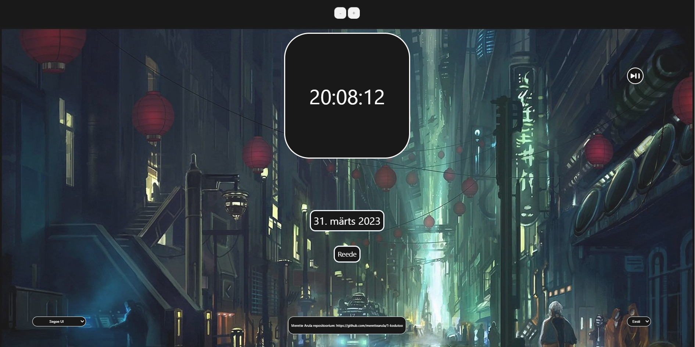

Autor: Merette Arula

Eesrakenduste arendamise aine esimese kodutöö raames lõin chatGPT abiga elektroonilise kella. 
Elektrooniline kell näitab kellaaega, kuupäeva ja nädalapäeva. 

Lisasin kellale juurde 6 erinevat funktsionaalsust:
1. Kella taustale klikkides muudetakse kella taustavärvi (randomi abil genereeritakse RGB värvikood)
2. Taustale või kellale klikkides muudetakse taustapilti (valikus neli pilti)
3. Vasakust paremast nurgast on võimalik muuta teksti fonti
4. Paremast vasakust nurgast on võimalik vahetada keelt, võimalik on vaadata kas Eesti või Inglise keeles.
5. Kella kohal on - ja + mille abil on kella võimalik suuremaks ja väiksemaks teha
6. Paremalt ülevalt nurgast saab mängima panna muusika. 

