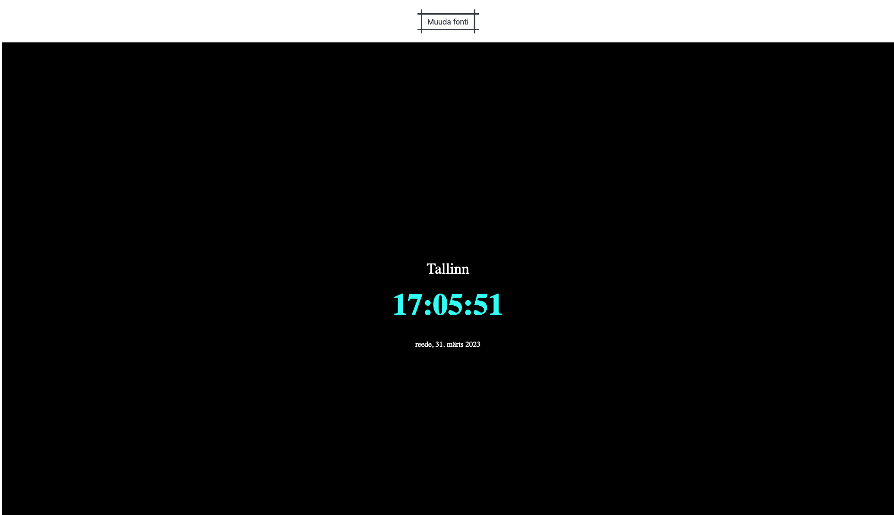
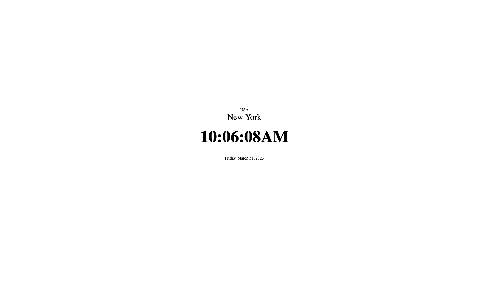
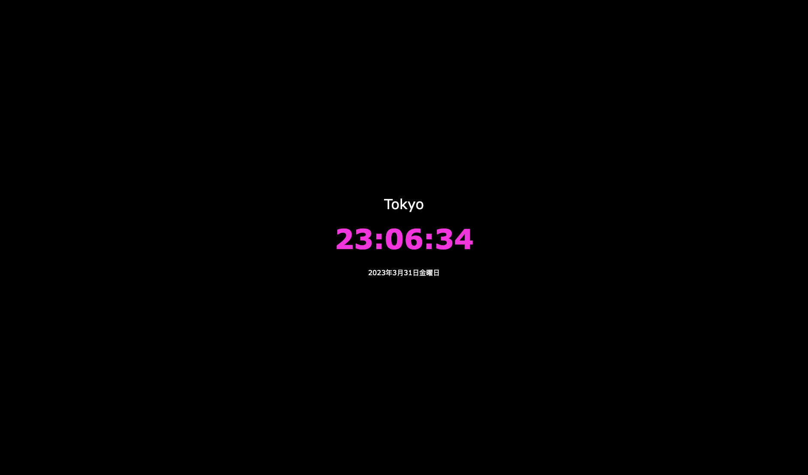

Autor - Kristel Kolkanen
https://www.tlu.ee/~kolkanen/clock/myClock.html

Funktsionaalsused:

1. taustal hakkab automaatselt mängima muusika, mida saab pausile panna " - " klahviga ja käima panna " + " klahviga
2. kuvatakse kolme erinevat aega - Tallinn, New York, Tokyo - koos kuupäeva ja nädalapäevaga, iga aeg mahutub korraga üksinda lehele ja on eraldi mõjutatav
3. hiirega lehel klõpsates saab muuta lehe stiili - must taust ja valge tekst või valge taust ja must tekst - iga ajatsoon on eraldi muudetav
4. lehel on nupp, millele vajutades saab muuta globaalselt teksti fonti (random)
5. hiirega linna nime kohale minnes, avaneb peidetud tekst, milleks on selle linna riik, nime juurest hiirega lahkudes kaob ka peidetud tekst
6. hiirega üle kellaaja liikudes muutub kellaaja värv (random)

